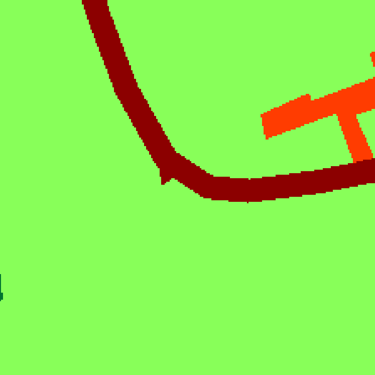

# U-Net

This repository provides a simple and reliable tool to perform land cover classification using a U-Net model. A tutorial is provided here, but the notebook is flexible and can be adapted to your own datasets, satellite images, and labels. The only requirements are a Python environment capable of running Jupyter notebooks  with the dependencies asked and QGIS.

The method requires as input a .tif image (the number of channels is adjustable), its corresponding label in .tif format, and a shapefile grid (Figure 1 & 2)

If you want to try with the data of this tutorial you can download all data from this google drive : https://drive.google.com/drive/folders/12HtGZrBgDsjLLpBF9wwj7KBAhDIocoRa?usp=sharing
(For copyright reasons, the Pleiades image has been removed from the drive, but on request I can send it to authorised users. You can however use other free images on the same zone (Sentinel-2 type). In this case please ask : adrien.leguillou@univ-brest.fr)


IMPORTANT: In this tutorial, we use Pléiades satellite imagery (with a 50 cm per pixel resolution) Airbus DS©  and OCS GE labels (freely available here : https://geoservices.ign.fr/ocsge). This repository offers a modular approach that can be adapted to different datasets, resolutions, and label classes. Whether you are working with RGB images or multi-spectral imagery, this workflow allows you to customize the number of classes to predict.

We downloaded the OCS GE dataset for the area corresponding to our satellite image. We then grouped the classes as follows:

- 0 for road 
- 1 for building 
- 2 for water 
- 3 for grass 
- 4 for forest 
- 5 for sand

  
Afterwards, we rasterized this data to create the labels for training.

Currently, we provide a single U-Net architecture, which requires:

Input images: 224 x 224 x n_channels (e.g., RGB or multi-spectral images).
Input labels: 224 x 224 x 1 (byte or Int8 format).
Prerequisites
Before getting started, ensure you have the following:

A satellite image: In GeoTIFF format (.tif).
A label image: With the same extent and projection as the satellite image.
A grid shapefile: For dividing the images into patches.
Creating the Grid
You can generate a grid using QGIS with the "Create Grids" tool. The grid must align closely with the image resolution to produce patches of the desired size (224 x 224 pixels).

For example:

With Pléiades imagery at 50 cm per pixel resolution, a patch of 224 pixels corresponds to 112 meters (since 224 ÷ 2 = 112)

Therefore, you should create a grid with 112 meters as both the width and height to achieve 224 x 224 pixel patches.
By following this setup, the U-Net model will be able to process the patches efficiently and ensure proper alignment between the images and labels.


|  |  |
|:--------------------------------:|:--------------------------------:|
| **Figure 1**: Label from OCS GE     | **Figure 2**: Pléiades Image     |

When you create your grid , its possible that in the border right of your grid the image and the grid is not superpose perfectly , in this case you have to delete the last colums and the last rows of your grid (Figure 3 , 4 ,5)
Once the grid is created, you will need to use the "Add Autoincrement Field" tool in QGIS to generate a new field with automatic numbering. This numbering will start from 0 and increment sequentially for each patch in the grid. After adding the autoincrement field, use the generated numbers to extract image patches. The following part of the code iterates through each row in the grid and extracts the corresponding image and label patches: 

```python
for idx, row in grid.iterrows():
    geom = [row['geometry']]  # Get the geometry for the current patch
    patch_img, transform = mask(src_img, geom, crop=True)  # Extract image patch
    patch_lbl, _ = mask(src_lbl, geom, crop=True)  # Extract label patch
```


|  |  |  |
|:-----------------------------:|:-----------------------------:|:-----------------------------:|
| **Figure 3**: The grid   | **Figure 4**:  No overlay   | **Figure 5**: The part to be deleted   |


## Step 1: Patch Extraction

The **Patch Extraction** process is explained in detail in the notebook under the section **"Patch Extraction"** (look for the header with this name).

👉 **[Go to the Notebook](./Toolbox/Unet_tutorial.ipynb)** to find this section.

To prepare the training, validation, and test datasets for the U-Net model, you need to extract image patches and their corresponding labels. This process divides large geospatial images into smaller, more manageable sections.

---

### **Code Example**

Below is the Python function to perform patch extraction. It:
- Reads the satellite images, labels, and grid files.
- Divides the data into training, validation, and test sets.
- Extracts patches and saves them in respective directories.

```python
def extract_patches(image_path, label_path, shapefile_path, output_dir, train_ratio=0.75, val_ratio=0.2, test_ratio=0.05):

    # Open the image and label files
    with rasterio.open(image_path) as src_img:
        with rasterio.open(label_path) as src_lbl:
            grid = gpd.read_file(shapefile_path)

            # Directory setup
            train_img_dir = os.path.join(output_dir, 'train/images')
            val_img_dir = os.path.join(output_dir, 'validation/images')
            test_img_dir = os.path.join(output_dir, 'test/images')
            train_lbl_dir = os.path.join(output_dir, 'train/labels')
            val_lbl_dir = os.path.join(output_dir, 'validation/labels')
            test_lbl_dir = os.path.join(output_dir, 'test/labels')
            
            for dir_path in [train_img_dir, val_img_dir, test_img_dir, train_lbl_dir, val_lbl_dir, test_lbl_dir]:
                if not os.path.exists(dir_path):
                    os.makedirs(dir_path)

            # Shuffle and split the patches
            indices = list(grid.index)
            random.shuffle(indices)
            num_patches = len(indices)
            num_train = int(train_ratio * num_patches)
            num_val = int(val_ratio * num_patches)
            train_indices = indices[:num_train]
            val_indices = indices[num_train:num_train + num_val]
            test_indices = indices[num_train + num_val:]
            
            # Helper to save patches
            def save_patch_and_label(patch, label, transform, output_img_subdir, output_lbl_subdir, patch_filename):
                patch_img_path = os.path.join(output_img_subdir, patch_filename)
                with rasterio.open(
                    patch_img_path, 'w',
                    driver='GTiff',
                    height=224, width=224,
                    count=4, dtype=patch.dtype, crs=src_img.crs, transform=transform
                ) as dst_img:
                    dst_img.write(patch)
                
                patch_lbl_path = os.path.join(output_lbl_subdir, patch_filename)
                with rasterio.open(
                    patch_lbl_path, 'w',
                    driver='GTiff',
                    height=224, width=224,
                    count=1, dtype=label.dtype, crs=src_lbl.crs, transform=transform
                ) as dst_lbl:
                    dst_lbl.write(label[0, :, :], 1)
            
            # Process each patch
            for idx, row in grid.iterrows():
                geom = [row['geometry']]
                patch_img, transform = mask(src_img, geom, crop=True)
                patch_lbl, _ = mask(src_lbl, geom, crop=True)

                patch_filename = f"patch_{idx}.tif"
                if idx in train_indices:
                    save_patch_and_label(patch_img, patch_lbl, transform, train_img_dir, train_lbl_dir, patch_filename)
                elif idx in val_indices:
                    save_patch_and_label(patch_img, patch_lbl, transform, val_img_dir, val_lbl_dir, patch_filename)
                elif idx in test_indices:
                    save_patch_and_label(patch_img, patch_lbl, transform, test_img_dir, test_lbl_dir, patch_filename)

print("Patch extraction complete!")

```

|  |  |
|:--------------------------------:|:--------------------------------:|
| **Figure 6**: Label example     | **Figure 7**: Patch example     |

### Step 2: Image pre-processing

---

This cells aims to prepare the dataset for the training of the model. The cells will read your dataset, normalize them, transform them as tensor, you can also visualise a dataset to check if you patch and labels are the same for the training.
```python

# Normalization
def normalize_img(img):
    return img / np.max(img)

# Function to read .tif files and convert them into tensors
def load_data(image_dir, mask_dir):
    images = []
    masks = []
    for img_file in os.listdir(image_dir):
        if img_file.endswith('.tif') or img_file.endswith('.tiff'):
            img_path = os.path.join(image_dir, img_file)
            mask_path = os.path.join(mask_dir, img_file)
            
            # Read images and masks
            img = tiff.imread(img_path).astype(np.float32)
            mask = tiff.imread(mask_path).astype(np.uint8)
            
            img = normalize_img(img)
            
            images.append(img)
            masks.append(mask)
    
    # Convert the lists into numpy arrays
    images = np.array(images)
    masks = np.array(masks)
    
    # Convert numpy arrays into tensors
    images = tf.convert_to_tensor(images, dtype=tf.float32)
    masks = tf.convert_to_tensor(masks, dtype=tf.uint8)
    
    return images, masks

train_image_dir = '/Patch/train/images'
train_mask_dir = '/Patch/train/labels'
val_image_dir = '/Patch/validation/images/'
val_mask_dir = '/Patch/validation/labels'


# Load and transform the training data
train_images, train_masks = load_data(train_image_dir, train_mask_dir)
val_images, val_masks = load_data(val_image_dir, val_mask_dir)

print(f'Shape of training images: {train_images.shape}')
print(f'Shape of training labels: {train_masks.shape}')

# Check the pixel values of the images
print(f'Minimum and maximum values of the training images: {tf.reduce_min(train_images).numpy()}, {tf.reduce_max(train_images).numpy()}')
print(f'Minimum and maximum values of the training labels: {tf.reduce_min(train_masks).numpy()}, {tf.reduce_max(train_masks).numpy()}')

print(f'Minimum and maximum values of the validation images: {tf.reduce_min(val_images).numpy()}, {tf.reduce_max(val_images).numpy()}')
print(f'Minimum and maximum values of the validation labels: {tf.reduce_min(val_masks).numpy()}, {tf.reduce_max(val_masks).numpy()}')

# Display an RGB image and its corresponding mask
idx = 17  # You can change this index to visualize other images
plt.figure(figsize=(15, 5))

plt.subplot(1, 2, 1)
plt.imshow(train_images[idx][:, :, :3])  
plt.title('Image d\'entraînement (RGB)')

plt.subplot(1, 2, 2)
plt.imshow(train_masks[idx], cmap='gray') 
plt.title('Masque d\'entraînement')

plt.show()

```

### Step 3: Training of the U-net Model

---

```python

# Function to build the U-Net model
def unet_advanced(input_shape, num_classes=6):
    inputs = Input(input_shape)
    
    # Encodeur
    conv1 = Conv2D(64, 3, padding='same')(inputs)
    conv1 = BatchNormalization()(conv1)
    conv1 = Activation('relu')(conv1)
    conv1 = Conv2D(64, 3, padding='same')(conv1)
    conv1 = BatchNormalization()(conv1)
    conv1 = Activation('relu')(conv1)
    pool1 = MaxPooling2D(pool_size=(2, 2))(conv1)
    pool1 = Dropout(0.5)(pool1)

    conv2 = Conv2D(128, 3, padding='same')(pool1)
    conv2 = BatchNormalization()(conv2)
    conv2 = Activation('relu')(conv2)
    conv2 = Conv2D(128, 3, padding='same')(conv2)
    conv2 = BatchNormalization()(conv2)
    conv2 = Activation('relu')(conv2)
    pool2 = MaxPooling2D(pool_size=(2, 2))(conv2)
    pool2 = Dropout(0.5)(pool2)
    
    conv3 = Conv2D(256, 3, padding='same')(pool2)
    conv3 = BatchNormalization()(conv3)
    conv3 = Activation('relu')(conv3)
    conv3 = Conv2D(256, 3, padding='same')(conv3)
    conv3 = BatchNormalization()(conv3)
    conv3 = Activation('relu')(conv3)
    pool3 = MaxPooling2D(pool_size=(2, 2))(conv3)
    pool3 = Dropout(0.5)(pool3)
    
    conv4 = Conv2D(512, 3, padding='same')(pool3)
    conv4 = BatchNormalization()(conv4)
    conv4 = Activation('relu')(conv4)
    conv4 = Conv2D(512, 3, padding='same')(conv4)
    conv4 = BatchNormalization()(conv4)
    conv4 = Activation('relu')(conv4)
    pool4 = MaxPooling2D(pool_size=(2, 2))(conv4)
    pool4 = Dropout(0.5)(pool4)
    
    conv5 = Conv2D(1024, 3, padding='same')(pool4)
    conv5 = BatchNormalization()(conv5)
    conv5 = Activation('relu')(conv5)
    conv5 = Conv2D(1024, 3, padding='same')(conv5)
    conv5 = BatchNormalization()(conv5)
    conv5 = Activation('relu')(conv5)

    up6 = UpSampling2D(size=(2, 2))(conv5)
    merge6 = Concatenate()([conv4, up6])
    conv6 = Conv2D(512, 3, padding='same')(merge6)
    conv6 = BatchNormalization()(conv6)
    conv6 = Activation('relu')(conv6)
    conv6 = Conv2D(512, 3, padding='same')(conv6)
    conv6 = BatchNormalization()(conv6)
    conv6 = Activation('relu')(conv6)

    up7 = UpSampling2D(size=(2, 2))(conv6)
    merge7 = Concatenate()([conv3, up7])
    conv7 = Conv2D(256, 3, padding='same')(merge7)
    conv7 = BatchNormalization()(conv7)
    conv7 = Activation('relu')(conv7)
    conv7 = Conv2D(256, 3, padding='same')(conv7)
    conv7 = BatchNormalization()(conv7)
    conv7 = Activation('relu')(conv7)

    up8 = UpSampling2D(size=(2, 2))(conv7)
    merge8 = Concatenate()([conv2, up8])
    conv8 = Conv2D(128, 3, padding='same')(merge8)
    conv8 = BatchNormalization()(conv8)
    conv8 = Activation('relu')(conv8)
    conv8 = Conv2D(128, 3, padding='same')(conv8)
    conv8 = BatchNormalization()(conv8)
    conv8 = Activation('relu')(conv8)
    
    up9 = UpSampling2D(size=(2, 2))(conv8)
    merge9 = Concatenate()([conv1, up9])
    conv9 = Conv2D(64, 3, padding='same')(merge9)
    conv9 = BatchNormalization()(conv9)
    conv9 = Activation('relu')(conv9)
    conv9 = Conv2D(64, 3, padding='same')(conv9)
    conv9 = BatchNormalization()(conv9)
    conv9 = Activation('relu')(conv9)

    outputs = Conv2D(num_classes, 1, activation='softmax')(conv9)

    model = Model(inputs=inputs, outputs=outputs)
    model.compile(optimizer=Adam(), loss='sparse_categorical_crossentropy', metrics=['accuracy'])
    return model

# Define the parameters
img_height = 224
img_width = 224
num_channels = 4  # Variable to select the number of input channels
num_classes = 6   # Here is the number of classes you need to predict +1
batch_size = 4   # Reduce the batch size to decrease memory usage

# Initialize the U-Net model
input_shape = (img_height, img_width, num_channels)
model = unet_advanced(input_shape, num_classes=num_classes)
model.summary()

# Define the callback to save the best epoch
saved_model_path = "/path/to/your/saved_model"
checkpoint_cb = ModelCheckpoint(
    filepath=saved_model_path,  # Path to save the best model
    monitor='val_loss',
    mode='min',
    save_best_only=True,
    save_format="tf",  # Ensure SavedModel format
    verbose=1
)

# Train the model with the callback
history = model.fit(
    train_images,
    train_masks,
    batch_size=batch_size,
    epochs=100,
    validation_data=(val_images, val_masks),
    callbacks=[checkpoint_cb]
)

print(f"The best model has been saved in SavedModel format at {saved_model_path}.")

# After training, plot the loss and accuracy graphs
def plot_training_history(history):
    # Plot training & validation accuracy values
    plt.figure(figsize=(12, 6))

    plt.subplot(1, 2, 1)
    plt.plot(history.history['accuracy'], label='Train Accuracy')
    plt.plot(history.history['val_accuracy'], label='Validation Accuracy')
    plt.title('Model Accuracy')
    plt.xlabel('Epoch')
    plt.ylabel('Accuracy')
    plt.legend()

    # Plot training & validation loss values
    plt.subplot(1, 2, 2)
    plt.plot(history.history['loss'], label='Train Loss')
    plt.plot(history.history['val_loss'], label='Validation Loss')
    plt.title('Model Loss')
    plt.xlabel('Epoch')
    plt.ylabel('Loss')
    plt.legend()

    # Save the plot as a PNG file
    plt.savefig('/path/to/your/training_history.png')
    plt.show()

# Call the function to plot and save the training history
plot_training_history(history)

print("Training history plot is saved.")

```


```python 
Prompt :

Model: "model"
__________________________________________________________________________________________________
 Layer (type)                Output Shape                 Param #   Connected to                  
==================================================================================================
 input_1 (InputLayer)        [(None, 224, 224, 4)]        0         []                            
                                                                                                  
 conv2d (Conv2D)             (None, 224, 224, 64)         2368      ['input_1[0][0]']             
                                                                                                  
 batch_normalization (Batch  (None, 224, 224, 64)         256       ['conv2d[0][0]']              
 Normalization)                                                                                   
                                                                                                  
 activation (Activation)     (None, 224, 224, 64)         0         ['batch_normalization[0][0]'] 
                                                                                                  
 conv2d_1 (Conv2D)           (None, 224, 224, 64)         36928     ['activation[0][0]']          
                                                                                                  
 batch_normalization_1 (Bat  (None, 224, 224, 64)         256       ['conv2d_1[0][0]']            
 chNormalization)                                                                                 
                                                                                                  
 activation_1 (Activation)   (None, 224, 224, 64)         0         ['batch_normalization_1[0][0]'
                                                                    ]                             
                                                                                                  
 max_pooling2d (MaxPooling2  (None, 112, 112, 64)         0         ['activation_1[0][0]']        
 D)                                                                                               
                                                                                                  
 dropout (Dropout)           (None, 112, 112, 64)         0         ['max_pooling2d[0][0]']       
                                                                                                  
 conv2d_2 (Conv2D)           (None, 112, 112, 128)        73856     ['dropout[0][0]']             
                                                                                                  
 batch_normalization_2 (Bat  (None, 112, 112, 128)        512       ['conv2d_2[0][0]']            
 chNormalization)                                                                                 
                                                                                                  
 activation_2 (Activation)   (None, 112, 112, 128)        0         ['batch_normalization_2[0][0]'
                                                                    ]                             
                                                                                                  
 conv2d_3 (Conv2D)           (None, 112, 112, 128)        147584    ['activation_2[0][0]']        
                                                                                                  
 batch_normalization_3 (Bat  (None, 112, 112, 128)        512       ['conv2d_3[0][0]']            
 chNormalization)                                                                                 
                                                                                                  
 activation_3 (Activation)   (None, 112, 112, 128)        0         ['batch_normalization_3[0][0]'
                                                                    ]                             
                                                                                                  
 max_pooling2d_1 (MaxPoolin  (None, 56, 56, 128)          0         ['activation_3[0][0]']        
 g2D)                                                                                             
                                                                                                  
 dropout_1 (Dropout)         (None, 56, 56, 128)          0         ['max_pooling2d_1[0][0]']     
                                                                                                  
 conv2d_4 (Conv2D)           (None, 56, 56, 256)          295168    ['dropout_1[0][0]']           
                                                                                                  
 batch_normalization_4 (Bat  (None, 56, 56, 256)          1024      ['conv2d_4[0][0]']            
 chNormalization)                                                                                 
                                                                                                  
 activation_4 (Activation)   (None, 56, 56, 256)          0         ['batch_normalization_4[0][0]'
                                                                    ]                             
                                                                                                  
 conv2d_5 (Conv2D)           (None, 56, 56, 256)          590080    ['activation_4[0][0]']        
                                                                                                  
 batch_normalization_5 (Bat  (None, 56, 56, 256)          1024      ['conv2d_5[0][0]']            
 chNormalization)                                                                                 
                                                                                                  
 activation_5 (Activation)   (None, 56, 56, 256)          0         ['batch_normalization_5[0][0]'
                                                                    ]                             
                                                                                                  
 max_pooling2d_2 (MaxPoolin  (None, 28, 28, 256)          0         ['activation_5[0][0]']        
 g2D)                                                                                             
                                                                                                  
 dropout_2 (Dropout)         (None, 28, 28, 256)          0         ['max_pooling2d_2[0][0]']     
                                                                                                  
 conv2d_6 (Conv2D)           (None, 28, 28, 512)          1180160   ['dropout_2[0][0]']           
                                                                                                  
 batch_normalization_6 (Bat  (None, 28, 28, 512)          2048      ['conv2d_6[0][0]']            
 chNormalization)                                                                                 
                                                                                                  
 activation_6 (Activation)   (None, 28, 28, 512)          0         ['batch_normalization_6[0][0]'
                                                                    ]                             
                                                                                                  
 conv2d_7 (Conv2D)           (None, 28, 28, 512)          2359808   ['activation_6[0][0]']        
                                                                                                  
 batch_normalization_7 (Bat  (None, 28, 28, 512)          2048      ['conv2d_7[0][0]']            
 chNormalization)                                                                                 
                                                                                                  
 activation_7 (Activation)   (None, 28, 28, 512)          0         ['batch_normalization_7[0][0]'
                                                                    ]                             
                                                                                                  
 max_pooling2d_3 (MaxPoolin  (None, 14, 14, 512)          0         ['activation_7[0][0]']        
 g2D)                                                                                             
                                                                                                  
 dropout_3 (Dropout)         (None, 14, 14, 512)          0         ['max_pooling2d_3[0][0]']     
                                                                                                  
 conv2d_8 (Conv2D)           (None, 14, 14, 1024)         4719616   ['dropout_3[0][0]']           
                                                                                                  
 batch_normalization_8 (Bat  (None, 14, 14, 1024)         4096      ['conv2d_8[0][0]']            
 chNormalization)                                                                                 
                                                                                                  
 activation_8 (Activation)   (None, 14, 14, 1024)         0         ['batch_normalization_8[0][0]'
                                                                    ]                             
                                                                                                  
 conv2d_9 (Conv2D)           (None, 14, 14, 1024)         9438208   ['activation_8[0][0]']        
                                                                                                  
 batch_normalization_9 (Bat  (None, 14, 14, 1024)         4096      ['conv2d_9[0][0]']            
 chNormalization)                                                                                 
                                                                                                  
 activation_9 (Activation)   (None, 14, 14, 1024)         0         ['batch_normalization_9[0][0]'
                                                                    ]                             
                                                                                                  
 up_sampling2d (UpSampling2  (None, 28, 28, 1024)         0         ['activation_9[0][0]']        
 D)                                                                                               
                                                                                                  
 concatenate (Concatenate)   (None, 28, 28, 1536)         0         ['activation_7[0][0]',        
                                                                     'up_sampling2d[0][0]']       
                                                                                                  
 conv2d_10 (Conv2D)          (None, 28, 28, 512)          7078400   ['concatenate[0][0]']         
                                                                                                  
 batch_normalization_10 (Ba  (None, 28, 28, 512)          2048      ['conv2d_10[0][0]']           
 tchNormalization)                                                                                
                                                                                                  
 activation_10 (Activation)  (None, 28, 28, 512)          0         ['batch_normalization_10[0][0]
                                                                    ']                            
                                                                                                  
 conv2d_11 (Conv2D)          (None, 28, 28, 512)          2359808   ['activation_10[0][0]']       
                                                                                                  
 batch_normalization_11 (Ba  (None, 28, 28, 512)          2048      ['conv2d_11[0][0]']           
 tchNormalization)                                                                                
                                                                                                  
 activation_11 (Activation)  (None, 28, 28, 512)          0         ['batch_normalization_11[0][0]
                                                                    ']                            
                                                                                                  
 up_sampling2d_1 (UpSamplin  (None, 56, 56, 512)          0         ['activation_11[0][0]']       
 g2D)                                                                                             
                                                                                                  
 concatenate_1 (Concatenate  (None, 56, 56, 768)          0         ['activation_5[0][0]',        
 )                                                                   'up_sampling2d_1[0][0]']     
                                                                                                  
 conv2d_12 (Conv2D)          (None, 56, 56, 256)          1769728   ['concatenate_1[0][0]']       
                                                                                                  
 batch_normalization_12 (Ba  (None, 56, 56, 256)          1024      ['conv2d_12[0][0]']           
 tchNormalization)                                                                                
                                                                                                  
 activation_12 (Activation)  (None, 56, 56, 256)          0         ['batch_normalization_12[0][0]
                                                                    ']                            
                                                                                                  
 conv2d_13 (Conv2D)          (None, 56, 56, 256)          590080    ['activation_12[0][0]']       
                                                                                                  
 batch_normalization_13 (Ba  (None, 56, 56, 256)          1024      ['conv2d_13[0][0]']           
 tchNormalization)                                                                                
                                                                                                  
 activation_13 (Activation)  (None, 56, 56, 256)          0         ['batch_normalization_13[0][0]
                                                                    ']                            
                                                                                                  
 up_sampling2d_2 (UpSamplin  (None, 112, 112, 256)        0         ['activation_13[0][0]']       
 g2D)                                                                                             
                                                                                                  
 concatenate_2 (Concatenate  (None, 112, 112, 384)        0         ['activation_3[0][0]',        
 )                                                                   'up_sampling2d_2[0][0]']     
                                                                                                  
 conv2d_14 (Conv2D)          (None, 112, 112, 128)        442496    ['concatenate_2[0][0]']       
                                                                                                  
 batch_normalization_14 (Ba  (None, 112, 112, 128)        512       ['conv2d_14[0][0]']           
 tchNormalization)                                                                                
                                                                                                  
 activation_14 (Activation)  (None, 112, 112, 128)        0         ['batch_normalization_14[0][0]
                                                                    ']                            
                                                                                                  
 conv2d_15 (Conv2D)          (None, 112, 112, 128)        147584    ['activation_14[0][0]']       
                                                                                                  
 batch_normalization_15 (Ba  (None, 112, 112, 128)        512       ['conv2d_15[0][0]']           
 tchNormalization)                                                                                
                                                                                                  
 activation_15 (Activation)  (None, 112, 112, 128)        0         ['batch_normalization_15[0][0]
                                                                    ']                            
                                                                                                  
 up_sampling2d_3 (UpSamplin  (None, 224, 224, 128)        0         ['activation_15[0][0]']       
 g2D)                                                                                             
                                                                                                  
 concatenate_3 (Concatenate  (None, 224, 224, 192)        0         ['activation_1[0][0]',        
 )                                                                   'up_sampling2d_3[0][0]']     
                                                                                                  
 conv2d_16 (Conv2D)          (None, 224, 224, 64)         110656    ['concatenate_3[0][0]']       
                                                                                                  
 batch_normalization_16 (Ba  (None, 224, 224, 64)         256       ['conv2d_16[0][0]']           
 tchNormalization)                                                                                
                                                                                                  
 activation_16 (Activation)  (None, 224, 224, 64)         0         ['batch_normalization_16[0][0]
                                                                    ']                            
                                                                                                  
 conv2d_17 (Conv2D)          (None, 224, 224, 64)         36928     ['activation_16[0][0]']       
                                                                                                  
 batch_normalization_17 (Ba  (None, 224, 224, 64)         256       ['conv2d_17[0][0]']           
 tchNormalization)                                                                                
                                                                                                  
 activation_17 (Activation)  (None, 224, 224, 64)         0         ['batch_normalization_17[0][0]
                                                                    ']                            
                                                                                                  
 conv2d_18 (Conv2D)          (None, 224, 224, 6)          390       ['activation_17[0][0]']       
                                                                                                  
==================================================================================================
Total params: 31403398 (119.79 MB)
Trainable params: 31391622 (119.75 MB)
Non-trainable params: 11776 (46.00 KB)
_____________________________________________

Best epoch : Epoch 60: val_loss improved from 0.32535 to 0.30867, saving model to /path/to/your/model

```


### Step 4 : Displaying results :

---

```python

# Normalize the image
def normalize_img(img):
    return img / np.max(img)

# Load a test image and keep the geo-referencing information
def load_test_image(image_path):
    img = tiff.imread(image_path).astype(np.float32)
    img = normalize_img(img)
    img = np.expand_dims(img, axis=0)
    
    # Read the geo-referencing info (e.g., transform and CRS)
    with rasterio.open(image_path) as src:
        transform = src.transform
        crs = src.crs
        
    return img, transform, crs

# Load a test label
def load_test_mask(mask_path):
    mask = tiff.imread(mask_path).astype(np.uint8)
    return mask

# Paths to the test image and test label
test_image_path = 'test/images/patch_1.0.tif'  
test_mask_path = 'test/labels/patch_1.0.tif'

# Load the saved model (SavedModel format)
saved_model_path = '/path/to/your/saved_model'  # Path to the directory of the SavedModel
model = tf.keras.models.load_model(saved_model_path)

# Load and prepare the test image and test label
test_image, transform, crs = load_test_image(test_image_path)
test_mask = load_test_mask(test_mask_path)
print(f'Shape of test image: {test_image.shape}')
print(f'Shape of test mask: {test_mask.shape}')

# Predict the segmentation of the test image
prediction = model.predict(test_image)
predicted_mask = tf.argmax(prediction, axis=-1)
predicted_mask = tf.squeeze(predicted_mask).numpy()

# Save the predicted mask with geo-referencing
predicted_mask_path = 'example/predicted_mask.tif'  # Replace with the path where you want to save the predicted mask

# Write the predicted mask using rasterio, preserving the geo-referencing
with rasterio.open(test_image_path) as src:
    meta = src.meta  # Get the metadata (including the transform)
    meta.update(driver='GTiff', dtype=rasterio.uint8, count=1)  # Update the metadata to match the predicted mask's data type and single band count
    
    # Save the predicted mask as a georeferenced TIFF
    with rasterio.open(predicted_mask_path, 'w', **meta) as dst:
        dst.write(predicted_mask, 1)  # Write the predicted mask as the first band

print(f'Predicted mask saved as {predicted_mask_path}')

# Display the test image, the test label, and the predicted mask
plt.figure(figsize=(15, 5))

plt.subplot(1, 3, 1)
plt.imshow(test_image[0][:, :, :3])  
plt.title('Test Image (RGB)')

plt.subplot(1, 3, 2)
plt.imshow(test_mask, cmap='gray')
plt.title('Test Label')

plt.subplot(1, 3, 3)
plt.imshow(predicted_mask, cmap='gray')
plt.title('Predicted Mask')

plt.show()
```

The results : 

|  |  |  |
|:-----------------------------:|:-----------------------------:|:-----------------------------:|
| **Figure 8**: The 224x224 patch from the Pléiades image   | **Figure 9**:  The reference label  | **Figure 10**: The prediction   |

### Last step : Inference on large scale image

👉 **[Go to the Notebook](./Toolbox/Inference.ipynb)** to find this section.

---


If you wish to perform large-scale classification with a satellite image, you can use the "inference" notebook. The steps are as follows:

-  Cell 1 : Place your image (in .tif format) to split it into patches (the larger the overlap you choose, the less visible the artifacts will be, but the longer the processing time will be).
- Cell 2 : Once you have split your image into patches, the second cell will make predictions for each patch and save them in a new directory.
- Cell 3 : The final cell uses the GDAL merge tool to combine all the patches in the prediction directory into one large image.


|  |  |  |
|:-----------------------------:|:-----------------------------:|:-----------------------------:|
| **Figure 11**: The image before the prediction   | **Figure 12**:  the label from OCS GE  | **Figure 13**: The final result with the large scale image classification   |

